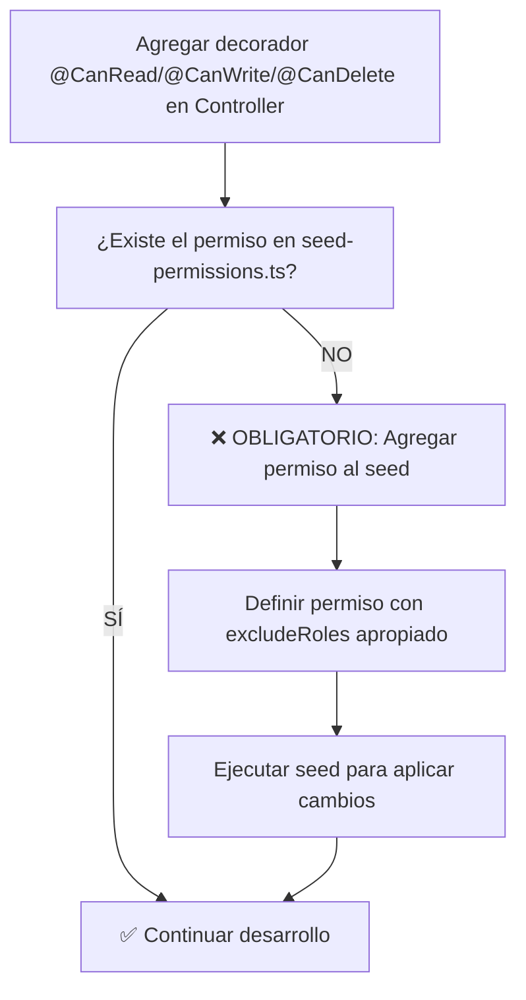

## ✨ Best Practices

### 1. Diseño de Entidades

```typescript
// ✅ Correcto
export class User extends AggregateRoot {
  private readonly _id: UserId;
  private _email: Email;
  
  private constructor(id: UserId, email: Email) {
    super();
    this._id = id;
    this._email = email;
  }
  
  public static create(email: Email): User {
    const id = UserId.create();
    const user = new User(id, email);
    user.addDomainEvent(new UserCreatedEvent(id, email));
    return user;
  }
  
  public changeEmail(newEmail: Email): void {
    if (this._email.equals(newEmail)) return;
    
    const oldEmail = this._email;
    this._email = newEmail;
    this.addDomainEvent(new EmailChangedEvent(this._id, oldEmail, newEmail));
  }
}

// ❌ Incorrecto
export class User {
  public id: string;  // ❌ Público
  public email: string;  // ❌ Primitivo
  
  constructor(id: string, email: string) {  // ❌ Público
    this.id = id;
    this.email = email;
  }
}
```

### 2. Commands vs Queries

```typescript
// ✅ Command - Modifica estado
export class CreateUserCommand {
  constructor(
    public readonly email: string,
    public readonly password: string,
  ) {}
}

// ✅ Query - Solo lee
export class GetUsersQuery {
  constructor(
    public readonly page: number = 1,
    public readonly limit: number = 10,
    public readonly filters?: UserFilters,
  ) {}
}
```

### 3. Event Naming

```typescript
// ✅ Correcto - Pasado
export class UserRegisteredEvent extends DomainEvent {}
export class EmailChangedEvent extends DomainEvent {}
export class AccountActivatedEvent extends DomainEvent {}

// ❌ Incorrecto - Presente/Futuro
export class UserRegisterEvent extends DomainEvent {}  // ❌
export class ChangeEmailEvent extends DomainEvent {}   // ❌
export class ActivateAccountEvent extends DomainEvent {} // ❌
```

### 4. Value Object Validation

```typescript
// ✅ Correcto
export class Email extends ValueObject<string> {
  protected validate(value: string): void {
    if (!value) {
      throw new InvalidEmailException('Email cannot be empty');
    }
    if (!this.isValidEmailFormat(value)) {
      throw new InvalidEmailException(`Invalid email format: ${value}`);
    }
    if (value.length > 254) {
      throw new InvalidEmailException('Email too long');
    }
  }
}
```

### 5. Repository Implementation

```typescript
// ✅ Opción 1: Usando Mapper
@Injectable()
export class UserRepository implements IUserRepository {
  async save(user: User): Promise<User> {
    const data = UserMapper.toPersistence(user);
    const saved = await this.prisma.user.upsert({
      where: { id: user.id.getValue() },
      update: data,
      create: data,
    });
    return UserMapper.toDomain(saved);
  }
}

// ✅ Opción 2: Definiendo directamente sin mapper
@Injectable()
export class UserRepository implements IUserRepository {
  async save(user: User): Promise<User> {
    const saved = await this.prisma.user.upsert({
      where: { id: user.id.getValue() },
      update: {
        email: user.email.getValue(),
        firstName: user.firstName.getValue(),
        lastName: user.lastName.getValue(),
        isActive: user.isActive,
        updatedAt: new Date(),
      },
      create: {
        id: user.id.getValue(),
        email: user.email.getValue(),
        firstName: user.firstName.getValue(),
        lastName: user.lastName.getValue(),
        passwordHash: user.passwordHash,
        isActive: user.isActive,
        emailVerified: user.emailVerified,
        createdAt: user.createdAt,
        updatedAt: new Date(),
      },
    });
    return UserMapper.toDomain(saved);
  }
}

// ❌ Incorrecto - Exposing Prisma
export class UserRepository {
  async save(user: any): Promise<any> {  // ❌ any
    return this.prisma.user.create({ data: user });  // ❌ Direct Prisma
  }
}
```

**Cuándo usar cada opción:**
- **Mapper**: Cuando la transformación es compleja o se reutiliza en múltiples lugares
- **Directo**: Para casos simples o cuando necesitas control fino sobre campos específicos

**Documentación de Interfaces:**
Todas las interfaces de repositorio deben incluir documentación JSDoc especificando el modelo de Prisma que utilizan:

```typescript
/**
 * User repository interface
 *
 * Implementations:
 * - {@link User} - Production Prisma/PostgreSQL implementation
 */
export interface IUserRepository {
  // methods...
}
```

### 6. Service Layer

```typescript
// ✅ Correcto - Service de dominio
@Injectable()
export class UserService {
  constructor(
    @Inject(USER_REPOSITORY) private readonly userRepo: IUserRepository,
    private readonly eventBus: EventBus,
  ) {}

  async registerUser(email: Email, password: Password): Promise<User> {
    // 1. Business rule validation
    const existingUser = await this.userRepo.findByEmail(email);
    if (existingUser) {
      throw new EmailAlreadyExistsException(email.getValue());
    }

    // 2. Create entity
    const user = User.create(email, password);
    
    // 3. Persist
    await this.userRepo.save(user);
    
    // 4. Events are published automatically
    return user;
  }
}
```

### 7. Transaction Management

```typescript
// ✅ Correcto - En Controller
@Controller('users')
export class UserController {
  constructor(
    private readonly commandBus: CommandBus,
    private readonly transactionService: TransactionService,
  ) {}

  @Post()
  async createUser(@Body() dto: CreateUserDto) {
    return this.transactionService.executeInTransaction(async () => {
      return this.commandBus.execute(new CreateUserCommand(dto.email, dto.password));
    });
  }
}
```

### 8. Module Organization

**ESTRUCTURA OBLIGATORIA**: Cada feature debe tener su propia carpeta en `src/presentation/modules/`

```typescript
📁 src/presentation/modules/
└── 📁 ai-persona/              # ✅ Carpeta por feature
    ├── ai-persona.controller.ts # ✅ Controller DENTRO del módulo
    └── ai-persona.module.ts     # ✅ Configuración del módulo
```

**Patrón de Módulo Correcto**:
```typescript
// ✅ CORRECTO - src/presentation/modules/ai-persona/ai-persona.module.ts
import { Module } from '@nestjs/common';
import { CqrsModule } from '@nestjs/cqrs';
import { CoreModule } from '@core/core.module';
import { AIPersonaController } from './ai-persona.controller'; // ✅ Import relativo

// Command Handlers
import { CreateAIPersonaCommandHandler } from '@application/commands/ai-persona/create-ai-persona.command';
import { UpdateAIPersonaCommandHandler } from '@application/commands/ai-persona/update-ai-persona.command';
// ... otros handlers

@Module({
  imports: [CqrsModule, CoreModule], // ✅ Dependencies necesarias
  controllers: [AIPersonaController], // ✅ Controller local
  providers: [
    // Command Handlers
    CreateAIPersonaCommandHandler,
    UpdateAIPersonaCommandHandler,
    // Query Handlers
    GetAIPersonaByIdQueryHandler,
    GetAllAIPersonasQueryHandler,
    // No services aquí - están en CoreModule
  ],
  exports: [], // Exports solo si otros módulos necesitan los handlers
})
export class AIPersonaModule {}

// ❌ INCORRECTO - Controller en carpeta separada
// src/presentation/controllers/ai-persona.controller.ts ❌
```

**Importación en App Module**:
```typescript
// src/app.module.ts
import { AIPersonaModule } from '@presentation/modules/ai-persona/ai-persona.module'; // ✅
```

**Beneficios de esta estructura**:
- **Cohesión**: Todo relacionado con una feature está junto
- **Escalabilidad**: Fácil agregar nuevas features sin conflictos
- **Mantenibilidad**: Cambios en una feature están aislados
- **Clarity**: Estructura clara y predecible

## 📏 Code Style Rules

### 1. Naming Conventions

- **Entities**: PascalCase (`UserActivityLog`)
- **Value Objects**: PascalCase + `.vo.ts` (`Email.vo.ts`)
- **Events**: PascalCase + Event suffix (`UserCreatedEvent`)
- **Interfaces**: PascalCase + `I` prefix (`IUserRepository`)
- **Constants**: SCREAMING_SNAKE_CASE (`USER_REPOSITORY`)
- **Response Interfaces**: `I` prefix + PascalCase + Response suffix (`IAIPersonaResponse`)
- **Response Files**: `entity-name.response.interface.ts` para interfaces, `entity-name.swagger.dto.ts` para clases Swagger, `entity-name.response.ts` para re-exports

### 2. File Organization

```
📁 feature-name/
├── feature-name.entity.ts
├── feature-name.service.ts
├── feature-name.repository.interface.ts
├── create-feature-name.command.ts
├── get-feature-name.query.ts
└── feature-name.events.ts
```

### 3. Import Order

```typescript
// 1. Node modules
import { Injectable, Inject } from '@nestjs/common';
import { EventBus } from '@nestjs/cqrs';

// 2. Domain imports
import { User } from '@core/entities/user.entity';
import { Email } from '@core/value-objects/email.vo';

// 3. Application imports
import { CreateUserCommand } from '@application/commands/user/create-user.command';

// 4. Infrastructure imports
import { UserRepository } from '@infrastructure/repositories/user.repository';

// 5. Shared imports
import { USER_REPOSITORY } from '@shared/constants/tokens';
```

## 🎯 Summary Checklist

Al implementar una nueva feature, verificar:

### Dominio y Aplicación
- [ ] **Entity** sigue el patrón (campos privados, constructor privado, factory methods)
- [ ] **Value Objects** para tipos complejos (cuando aportan valor)
- [ ] **Events** se emiten en operaciones importantes
- [ ] **Repository Interface** en dominio, implementación en infraestructura
- [ ] **Commands** para writes, **Queries** para reads
- [ ] **Commands usan Services** SIEMPRE (lógica de negocio centralizada)
- [ ] **Queries evalúan complejidad**: Repository directo si es simple, Service si hay lógica
- [ ] **Service** en dominio cuando hay lógica de negocio real

### Presentación y Estructura
- [ ] **Controller** en `src/presentation/modules/feature-name/feature-name.controller.ts`
- [ ] **Module** en `src/presentation/modules/feature-name/feature-name.module.ts`
- [ ] **Import relativo** del controller en el módulo (`./feature-name.controller`)
- [ ] **Transactions** en controllers para writes
- [ ] **DTOs** para entrada y salida
- [ ] **Response Interfaces** en `src/application/dtos/_responses/feature-name/`

### Arquitectura General
- [ ] **Mappers** para transformaciones
- [ ] **Module** bien configurado con dependencias
- [ ] **Tests** para cada capa
- [ ] **Error Handling** con excepciones que extienden de `DomainException`
- [ ] **Jerarquía de Excepciones** específica por dominio (e.g., `AIPersonaDomainException`)
- [ ] **Códigos de error** únicos en cada excepción
- [ ] **Configuration** estructurada, no `process.env` directo

## 📚 Referencias Implementadas

### Ejemplos de Arquitectura Correcta

#### CQRS Pattern - Enfoque Pragmático
```typescript
// ✅ CORRECTO - Command Handler (SIEMPRE usa Service)
@CommandHandler(CreateAIPersonaCommand)
export class CreateAIPersonaCommandHandler {
  constructor(
    private readonly aiPersonaService: AIPersonaService, // ✅ Service obligatorio para commands
  ) {}
  
  async execute(command: CreateAIPersonaCommand): Promise<IAIPersonaResponse> {
    const aiPersona = await this.aiPersonaService.createAIPersona(
      command.name,
      command.tone,
      // ... otros parámetros
    );
    return AIPersonaMapper.toResponse(aiPersona);
  }
}

// ✅ CORRECTO - Query Handler Simple (Repository directo)
@QueryHandler(GetAIPersonaByIdQuery)
export class GetAIPersonaByIdQueryHandler {
  constructor(
    @Inject(AI_PERSONA_REPOSITORY)
    private readonly aiPersonaRepository: IAIPersonaRepository, // ✅ Repository OK para query simple
  ) {}
  
  async execute(query: GetAIPersonaByIdQuery): Promise<IAIPersonaResponse> {
    const aiPersona = await this.aiPersonaRepository.findById(query.id);
    if (!aiPersona) {
      throw new AIPersonaNotFoundException(query.id);
    }
    return AIPersonaMapper.toResponse(aiPersona);
  }
}

// ✅ CORRECTO - Query Handler Complejo (Service para lógica)
@QueryHandler(GetCompanyAIPersonasWithStatsQuery)
export class GetCompanyAIPersonasWithStatsQueryHandler {
  constructor(
    private readonly aiPersonaService: AIPersonaService, // ✅ Service para lógica compleja
  ) {}
  
  async execute(query: GetCompanyAIPersonasWithStatsQuery): Promise<IAIPersonaWithStatsResponse[]> {
    // Service coordina múltiples repositorios y aplica lógica de negocio
    return this.aiPersonaService.getAIPersonasWithUsageStats(query.companyId);
  }
}
```

### Features Implementadas con Clean Architecture

#### Jerarquías de Excepciones Existentes
```typescript
// Jerarquías base definidas en domain-exceptions.ts
export abstract class UserDomainException extends DomainException {}
export abstract class RoleDomainException extends DomainException {}
export abstract class AuthenticationDomainException extends DomainException {}
export abstract class FileDomainException extends DomainException {}
export abstract class AIPersonaDomainException extends DomainException {}

// Ejemplo de uso: InvalidIndustryOperationChannelException
export class InvalidIndustryOperationChannelException extends DomainException {
  constructor(value: string) {
    const validValues = Object.values(IndustryOperationChannelEnum).join(', ');
    super(
      `Invalid industry operation channel "${value}". Valid values are: ${validValues}`,
      'INVALID_INDUSTRY_OPERATION_CHANNEL',
      { value, validValues },
    );
  }
}
```

#### Features Completas
- **UserActivityLog**: Ejemplo completo de entidad con eventos y versionado
- **User**: Entidad compleja con múltiples value objects y jerarquía de excepciones
- **AIPersona**: Feature con jerarquía de excepciones y CQRS pragmático
- **AuditLog**: Sistema de auditoría con queries flexibles
- **Events**: Sistema robusto de eventos de dominio
- **Repositories**: Patrón completo con interfaces y implementaciones
- **Modules**: Organización limpia con inyección de dependencias

## 🏆 Reglas de Oro del Proyecto

### 1. Centralización de Constantes y Enums
**NUNCA hardcodear strings** - Siempre usar enums y constantes centralizadas ubicadas en `src/shared/`:

```typescript
// ✅ CORRECTO - Usar enums existentes
import { UserActivityType } from '@shared/constants/user-activity-type.enum';
import { UserActivityImpact } from '@shared/constants/user-activity-impact.enum';

// ✅ CORRECTO - Crear nuevo enum si no existe
export enum NotificationStatus {
  PENDING = 'PENDING',
  SENT = 'SENT',
  FAILED = 'FAILED',
  DELIVERED = 'DELIVERED'
}

// ❌ INCORRECTO - Hardcodear strings
const status = 'PENDING'; // ❌ 
if (type === 'AUTHENTICATION') { // ❌
```

**Estructura de `src/shared/`:**
```
📁 src/shared/
├── 📁 constants/           # Enums y constantes
│   ├── user-activity-type.enum.ts
│   ├── user-activity-impact.enum.ts
│   └── notification-status.enum.ts
├── 📁 interfaces/          # Interfaces compartidas
├── 📁 types/              # Types compartidos
└── 📁 utils/              # Utilidades comunes
```

**Excepción**: Para eventos de dominio NO es necesario crear enums, pueden usar strings directamente.

### 2. Controllers Sin Lógica
**ZERO lógica de negocio en controllers** - Solo Commands y Queries:

```typescript
// ✅ CORRECTO - Controller limpio
@Controller('users')
export class UserController {
  constructor(
    private readonly commandBus: CommandBus,
    private readonly queryBus: QueryBus,
    private readonly transactionService: TransactionService,
  ) {}

  @Post()
  async createUser(@Body() dto: CreateUserDto) {
    return this.transactionService.executeInTransaction(async () => {
      return this.commandBus.execute(new CreateUserCommand(dto));
    });
  }

  @Get(':id')
  async getUserById(@Param('id') id: string) {
    return this.queryBus.execute(new GetUserByIdQuery(id));
  }
}

// ❌ INCORRECTO - Lógica en controller
@Controller('users')
export class UserController {
  @Post()
  async createUser(@Body() dto: CreateUserDto) {
    // ❌ Validación de negocio
    if (!dto.email.includes('@')) {
      throw new BadRequestException('Invalid email');
    }
    
    // ❌ Lógica de autorización
    if (user.role !== 'admin') {
      throw new ForbiddenException();
    }
    
    // ❌ Transformación de datos
    const hashedPassword = await bcrypt.hash(dto.password, 10);
  }
}
```

### 3. Documentación API con Bearer Auth y Tags
**SIEMPRE especificar la string en @ApiBearerAuth()**:

```typescript
// ✅ CORRECTO - Con nombre específico
@ApiBearerAuth('JWT-auth')
@UseGuards(JwtAuthGuard)
@Controller('users')
export class UserController {}

// ❌ INCORRECTO - Sin especificar
@ApiBearerAuth() // ❌ Falta la string
@UseGuards(JwtAuthGuard)
@Controller('users')
export class UserController {}
```

**OBLIGATORIO: @ApiTags en minúsculas con guiones**:

```typescript
// ✅ CORRECTO - Minúsculas con guiones
@ApiTags('ai-personas')
@Controller('ai-personas')
export class AIPersonaController {}

@ApiTags('user-activity-logs')
@Controller('user-activity-logs')
export class UserActivityLogController {}

@ApiTags('company-schedules')
@Controller('company-schedules') 
export class CompanySchedulesController {}

// ❌ INCORRECTO - Mayúsculas o espacios
@ApiTags('AI Personas') // ❌ Mayúsculas y espacios
@ApiTags('User Activity Logs') // ❌ Mayúsculas y espacios
@ApiTags('ai_personas') // ❌ Underscore en lugar de guión
@ApiTags('aiPersonas') // ❌ CamelCase
```

**Reglas para @ApiTags**:
- **Minúsculas**: Todos los caracteres en lowercase
- **Guiones**: Usar `-` para separar palabras, nunca espacios o underscores
- **Consistencia**: Debe coincidir con el path del @Controller
- **Plurales**: Usar forma plural cuando sea apropiado (`users`, `ai-personas`)

**Beneficios de esta convención**:
- **URLs consistentes**: Tag coincide con la ruta del controller
- **Swagger organizado**: Agrupación clara y legible en la documentación
- **SEO friendly**: URLs amigables para motores de búsqueda
- **Estándar REST**: Sigue las mejores prácticas de naming en APIs REST

### 🏆 Regla de Oro: Documentación Detallada de API

**ESTÁNDAR OBLIGATORIO**: Todos los endpoints deben documentarse con el mismo nivel de detalle que el `UserController`. 

#### Elementos Obligatorios en Cada Endpoint

**1. @ApiOperation Completa**:
```typescript
@ApiOperation({
  summary: 'Título descriptivo con roles en paréntesis',
  description: 
    'Descripción detallada del endpoint con:\n\n' +
    '- **Explicación de la funcionalidad**\n' +
    '- **Comportamiento específico por rol**\n' +
    '- **Restricciones de acceso**\n\n' +
    '📋 **Required Permission:** <code style="color: #27ae60; background: #e8f8f5; padding: 2px 6px; border-radius: 3px; font-weight: bold;">resource:action</code>\n\n' +
    '👥 **Roles with Access:**\n' +
    '- <code style="color: #d63031; background: #ffcccc; padding: 2px 6px; border-radius: 3px; font-weight: bold;">ROOT</code>\n' +
    '- <code style="color: #0984e3; background: #dfe6e9; padding: 2px 6px; border-radius: 3px; font-weight: bold;">ADMIN</code>\n\n' +
    '⚠️ **Restrictions:** Detalle de restricciones específicas'
})
```

**2. @ApiResponse Exhaustivas**:
```typescript
@ApiResponse({ status: HttpStatus.OK, description: 'Operación exitosa' })
@ApiResponse({ status: HttpStatus.BAD_REQUEST, description: 'Datos de entrada inválidos' })
@ApiResponse({ status: HttpStatus.NOT_FOUND, description: 'Recurso no encontrado' })
@ApiResponse({ status: HttpStatus.FORBIDDEN, description: 'Sin permisos requeridos' })
@ApiResponse({ status: HttpStatus.UNAUTHORIZED, description: 'No autenticado' })
```

**3. @ApiParam/@ApiBody Descriptivos**:
```typescript
@ApiParam({ 
  name: 'id', 
  description: 'Descripción específica del parámetro',
  example: 'uuid-example-value'
})
@ApiBody({
  type: DtoType,
  description: 'Descripción detallada del body y sus campos'
})
```

**4. Esquemas de Respuesta Detallados**:
```typescript
@ApiResponse({
  status: HttpStatus.OK,
  description: 'Descripción de la respuesta exitosa',
  schema: {
    type: 'object',
    properties: {
      id: { type: 'string', example: 'uuid-example' },
      name: { type: 'string', example: 'Ejemplo' },
      // ... todas las propiedades con ejemplos
    }
  }
})
```

#### Formato de Permisos y Roles

**Permisos con styling HTML**:
```typescript
'📋 **Required Permission:** <code style="color: #27ae60; background: #e8f8f5; padding: 2px 6px; border-radius: 3px; font-weight: bold;">resource:action</code>'
```

**Roles con colores específicos**:
```typescript
'👥 **Roles with Access:**\n' +
'- <code style="color: #d63031; background: #ffcccc; padding: 2px 6px; border-radius: 3px; font-weight: bold;">ROOT</code>\n' +
'- <code style="color: #e17055; background: #fab1a0; padding: 2px 6px; border-radius: 3px; font-weight: bold;">ROOT_READONLY</code>\n' +
'- <code style="color: #0984e3; background: #dfe6e9; padding: 2px 6px; border-radius: 3px; font-weight: bold;">ADMIN</code>\n' +
'- <code style="color: #00b894; background: #e8f5e9; padding: 2px 6px; border-radius: 3px; font-weight: bold;">MANAGER</code>\n' +
'- <code style="color: #e84393; background: #ffeaa7; padding: 2px 6px; border-radius: 3px; font-weight: bold;">SALES_AGENT</code>\n' +
'- <code style="color: #636e72; background: #dfe6e9; padding: 2px 6px; border-radius: 3px; font-weight: bold;">Any authenticated user</code>'
```

**Colores por tipo de permiso**:
- **READ**: `color: #27ae60; background: #e8f8f5` (Verde)
- **WRITE**: `color: #e74c3c; background: #ffeaa7` (Naranja)
- **UPDATE**: `color: #f39c12; background: #fff3cd` (Amarillo)
- **DELETE**: `color: #c0392b; background: #fadbd8` (Rojo)
- **ASSIGN**: `color: #8e44ad; background: #e8daef` (Púrpura)

#### Estructura de Descripción Obligatoria

```typescript
description:
  'Descripción principal de la funcionalidad.\n\n' +
  '**Comportamiento por Rol:**\n' +
  '- **Root**: Descripción específica\n' +
  '- **Admin**: Descripción específica\n' +
  '- **Manager**: Descripción específica\n\n' +
  '📋 **Required Permission:** [...]\n\n' +
  '👥 **Roles with Access:** [...]\n\n' +
  '⚠️ **Restrictions:** Detalles específicos de restricciones'
```

#### Ejemplo Completo (Referencia UserController)

**Ver `src/presentation/modules/user/user.controller.ts`** como ejemplo perfecto de:
- Documentación exhaustiva por endpoint
- Styling consistente de permisos y roles
- Esquemas de respuesta completos
- Manejo de todos los status codes posibles
- Descripciones detalladas del comportamiento por rol

#### Checklist de Documentación Obligatoria

- [ ] **@ApiOperation** con summary y description completa
- [ ] **Permisos** documentados con styling HTML 
- [ ] **Roles** listados con colores específicos
- [ ] **Restricciones** explicadas claramente
- [ ] **@ApiResponse** para todos los status codes posibles
- [ ] **@ApiParam/@ApiBody** con descriptions y examples
- [ ] **Esquemas** detallados para respuestas complejas
- [ ] **Comportamiento por rol** explicado específicamente

#### Antipatrón Prohibido

```typescript
// ❌ PROHIBIDO - Documentación mínima
@ApiOperation({ summary: 'Get users' })
@ApiResponse({ status: 200, description: 'Success' })

// ✅ OBLIGATORIO - Documentación completa como UserController
@ApiOperation({
  summary: 'Get all AI personas with role-based filtering (Root/Admin/Manager)',
  description: '[Descripción completa con roles, permisos, restricciones]'
})
@ApiResponse({ status: HttpStatus.OK, description: '[Descripción específica]' })
@ApiResponse({ status: HttpStatus.FORBIDDEN, description: '[Descripción específica]' })
// ... más responses
```

### 4. Centralización de Autorización Universal
**UserAuthorizationService contiene métodos UNIVERSALES de autorización**:

**Ubicación única**: `src/core/services/user-authorization.service.ts`

**Responsabilidades UNIVERSALES**:
- ✅ Verificación de permisos genéricos (`user.hasPermission()`)
- ✅ Jerarquía de roles (`canAccessRootFeatures()`, `canAccessAdminFeatures()`)
- ✅ Controles de company/tenant (`canAccessCompany()`, `canManageUser()`)
- ✅ Validaciones de usuario activo (`getCurrentUserSafely()`)
- ✅ Niveles de seguridad (`getUserSecurityLevel()`)

**Los servicios específicos USAN estos métodos universales para implementar su lógica:**

```typescript
// ✅ CORRECTO - AIPersonaService usa métodos universales
@Injectable()
export class AIPersonaService {
  constructor(
    private readonly userAuthService: UserAuthorizationService, // ✅ Servicio universal
    @Inject(AI_PERSONA_REPOSITORY) private readonly aiPersonaRepo: IAIPersonaRepository,
  ) {}

  async validateAIPersonaModification(aiPersonaId: string, currentUser: User): Promise<AIPersona> {
    const aiPersona = await this.aiPersonaRepo.findById(aiPersonaId);
    if (!aiPersona) {
      throw new AIPersonaNotFoundException(aiPersonaId);
    }

    // ✅ USAR métodos universales para implementar lógica específica
    if (aiPersona.isDefault && !this.userAuthService.canAccessRootFeatures(currentUser)) {
      throw new CannotModifyDefaultAIPersonaException();
    }

    if (aiPersona.companyId && !this.userAuthService.canAccessCompany(currentUser, aiPersona.companyId)) {
      throw new UnauthorizedAIPersonaModificationException();
    }

    return aiPersona;
  }

  async getCompanyAIPersonas(companyId: string, currentUser: User): Promise<AIPersona[]> {
    // ✅ USAR método universal de autorización de company
    if (!this.userAuthService.canAccessCompany(currentUser, companyId)) {
      return []; // O lanzar excepción según la lógica de negocio
    }

    return this.aiPersonaRepo.findAllByCompany(companyId);
  }
}

// ❌ INCORRECTO - Lógica de autorización hardcodeada
@Injectable()
export class AIPersonaService {
  async validateAIPersonaModification(aiPersonaId: string, userRole: string, userCompanyId?: string): Promise<AIPersona> {
    // ❌ Hardcodear roles y lógica de autorización
    if (aiPersona.isDefault && userRole !== 'root') { // ❌ String hardcodeado
      throw new CannotModifyDefaultAIPersonaException();
    }
    if (aiPersona.companyId !== userCompanyId) { // ❌ Lógica de company dispersa
      throw new UnauthorizedAIPersonaModificationException();
    }
  }
}
```

**Patrón de Reutilización**:
1. **Primero**: Revisar métodos universales existentes en `user-authorization.service.ts`
2. **Segundo**: Si no existe método universal, crearlo en `user-authorization.service.ts`
3. **Tercero**: Los servicios específicos USAN estos métodos universales
4. **Nunca**: Duplicar lógica de autorización o hardcodear roles/permisos

**Métodos universales del servicio**:
```typescript
// Métodos UNIVERSALES existentes
class UserAuthorizationService {
  // Verificación de características de usuario
  canAccessRootFeatures(user: User): boolean
  canAccessAdminFeatures(user: User): boolean
  canAccessCompany(user: User, companyId: string): boolean
  
  // Gestión de usuarios
  canManageUser(currentUser: User, targetUser: User): boolean
  getCurrentUserSafely(userId: string): Promise<User>
  
  // Permisos y recursos
  canAccessResource(user: User, resource: string, action: string): boolean
  getUserSecurityLevel(user: User): 'low' | 'medium' | 'high' | 'critical' | 'maximum'
}
```

**Separación de Responsabilidades**:
- **UserAuthorizationService**: Métodos universales de autorización
- **Servicios específicos**: Lógica de negocio que USA los métodos universales
- **Controllers**: Solo Commands y Queries (sin lógica)

### 5. Medidas de Seguridad en Servicios
**OBLIGATORIO: Implementar medidas de seguridad en métodos que lo requieran**

Cualquier método en servicios que maneje operaciones sensibles **DEBE** incluir validaciones de seguridad:

```typescript
// ✅ CORRECTO - Método con medidas de seguridad implementadas
async updateAIPersonaStatus(
  id: string,
  isActive: boolean, 
  updatedBy: string,
  currentUser: User,
): Promise<AIPersona> {
  // ✅ Security Measure: Validate user can modify this persona
  await this.validateAIPersonaModification(id, currentUser);
  
  // ✅ Security Measure: Log sensitive operation
  console.log(`User ${currentUser.id.getValue()} changing status of AI Persona ${id} to ${isActive}`);
  
  // Resto de lógica de negocio...
}

// ✅ CORRECTO - Método privado con documentación de seguridad
private async removeAllCompanyAssignments(aiPersonaId: string): Promise<void> {
  // ✅ Security Measure: Only accessible through authorized methods
  // Note: This method is private and can only be called from updateAIPersonaStatus,
  // which already has authorization checks in place.
  
  // Lógica de negocio...
}

// ❌ INCORRECTO - Método sensible sin medidas de seguridad
async updateAIPersonaStatus(id: string, isActive: boolean): Promise<AIPersona> {
  // ❌ No validación de autorización
  // ❌ No logging de operación sensible
  const aiPersona = await this.repository.findById(id);
  aiPersona.updateStatus(isActive);
  return this.repository.update(aiPersona);
}
```

**Operaciones que requieren medidas de seguridad**:
- ✅ Modificación de estados críticos (activar/desactivar)
- ✅ Eliminación de datos
- ✅ Cambios que afectan múltiples entidades
- ✅ Operaciones administrativas
- ✅ Asignación/remoción de permisos o roles

**Medidas de seguridad requeridas**:
1. **Validación de autorización**: Usar `UserAuthorizationService` 
2. **Logging de operaciones**: Documentar operaciones sensibles usando `ILogger`
3. **Validación de entidades**: Verificar existencia y estado
4. **Documentación de seguridad**: Comentar las medidas implementadas

### 6. Uso Obligatorio del Logger Service
**NUNCA usar console.log, console.error, console.warn directamente**

Siempre usar el servicio de logger inyectado para todas las operaciones de logging:

```typescript
// ✅ CORRECTO - Usar ILogger inyectado
@Injectable()
export class AIPersonaService {
  constructor(
    @Inject(LOGGER_SERVICE) private readonly logger: ILogger,
  ) {
    this.logger.setContext(AIPersonaService.name);
  }

  async someMethod(): Promise<void> {
    // ✅ Usar logger service
    this.logger.log('Operation started');
    this.logger.warn('Important business rule applied');
    this.logger.error('Operation failed', error.stack);
    this.logger.debug('Debug information');
  }
}

// ❌ INCORRECTO - Usar console directamente
class SomeService {
  async someMethod(): Promise<void> {
    console.log('Operation started'); // ❌ Prohibido
    console.warn('Warning message'); // ❌ Prohibido
    console.error('Error occurred'); // ❌ Prohibido
  }
}
```

**Beneficios del Logger Service**:
- ✅ Logging centralizado y configurable
- ✅ Niveles de log apropiados (LOG_LEVEL env var)
- ✅ Contexto automático del servicio
- ✅ Integración con sistemas de monitoreo
- ✅ Formato consistente de logs

**Métodos disponibles**:
- `logger.log()` - Información general
- `logger.warn()` - Advertencias y reglas de negocio
- `logger.error()` - Errores con stack trace
- `logger.debug()` - Información de depuración
- `logger.verbose()` - Información detallada

## 🔐 Gestión Obligatoria de Permisos

### Regla Fundamental de Permisos

**OBLIGATORIO**: Todos los permisos nuevos usados en controllers deben ser agregados al archivo `prisma/seed-permissions.ts`.

#### Flujo de Trabajo para Nuevos Permisos



#### Estructura de Permisos en Controllers

Los controllers DEBEN usar estos decoradores para control de acceso:

```typescript
// ✅ PATRÓN OBLIGATORIO en Controllers
@CanRead('resource-name')    // Para operaciones GET
@CanWrite('resource-name')   // Para operaciones POST/PUT/PATCH
@CanDelete('resource-name')  // Para operaciones DELETE

// ✅ EJEMPLO: AI Persona Controller
@Get()
@CanRead('ai-persona')  // ← ESTE permiso DEBE existir en seed-permissions.ts
async findAll() { }

@Post()
@CanWrite('ai-persona') // ← ESTE permiso DEBE existir en seed-permissions.ts
async create() { }

@Delete(':id')
@CanDelete('ai-persona') // ← ESTE permiso DEBE existir en seed-permissions.ts
async remove() { }
```

#### Definición de Permisos en Seed

**Ubicación**: `prisma/seed-permissions.ts`

**Estructura obligatoria para cada permiso**:

```typescript
{
  name: 'resource-name:action',           // FORMATO: resource:action
  description: 'Descripción clara del permiso',
  resource: 'resource-name',              // Debe coincidir con @CanAction('resource-name')
  action: 'action',                       // read/write/delete/manage/etc.
  excludeRoles: [configuración_de_roles], // Qué roles NO pueden tener este permiso
}
```

#### Ejemplo Completo: AI Persona Permissions

```typescript
// ✅ EJEMPLO CORRECTO - Permisos AI Persona agregados al seed
{
  name: 'ai-persona:read',
  description: 'Can read AI persona information and configurations',
  resource: 'ai-persona',
  action: 'read',
  excludeRoles: ALLOW_ALL_ROLES, // Todos los roles pueden leer
},
{
  name: 'ai-persona:write',
  description: 'Can create and update AI personas',
  resource: 'ai-persona', 
  action: 'write',
  excludeRoles: [PERMISSION_EXCLUDE_SYMBOLS.ALL_EXCEPT, RolesEnum.ROOT, RolesEnum.ADMIN, RolesEnum.MANAGER],
},
{
  name: 'ai-persona:delete',
  description: 'Can delete AI personas',
  resource: 'ai-persona',
  action: 'delete',
  excludeRoles: [PERMISSION_EXCLUDE_SYMBOLS.ALL_EXCEPT, RolesEnum.ROOT, RolesEnum.ADMIN],
},
```

#### Configuración de ExcludeRoles

**Opciones disponibles para `excludeRoles`**:

```typescript
// ✅ Permitir a todos los roles (incluyendo custom roles)
excludeRoles: ALLOW_ALL_ROLES

// ✅ Solo ROOT y ROOT_READONLY pueden tener este permiso
excludeRoles: [PERMISSION_EXCLUDE_SYMBOLS.ALL_EXCEPT, RolesEnum.ROOT, RolesEnum.ROOT_READONLY]

// ✅ ROOT, ADMIN y MANAGER pueden tener este permiso
excludeRoles: [PERMISSION_EXCLUDE_SYMBOLS.ALL_EXCEPT, RolesEnum.ROOT, RolesEnum.ADMIN, RolesEnum.MANAGER]

// ✅ Excluir solo roles custom (permitir todos los enum roles)
excludeRoles: [PERMISSION_EXCLUDE_SYMBOLS.CUSTOM_ROLES]

// ✅ Excluir solo GUEST
excludeRoles: [RolesEnum.GUEST]
```

#### Jerarquía de Permisos Recomendada

**Para operaciones de lectura** (`read`):
- Generalmente: `ALLOW_ALL_ROLES` (todos pueden leer)
- Información sensible: `[PERMISSION_EXCLUDE_SYMBOLS.ALL_EXCEPT, RolesEnum.ROOT, RolesEnum.ADMIN]`

**Para operaciones de escritura** (`write`):
- Gestión normal: `[PERMISSION_EXCLUDE_SYMBOLS.ALL_EXCEPT, RolesEnum.ROOT, RolesEnum.ADMIN, RolesEnum.MANAGER]`
- Solo administradores: `[PERMISSION_EXCLUDE_SYMBOLS.ALL_EXCEPT, RolesEnum.ROOT, RolesEnum.ADMIN]`

**Para operaciones de eliminación** (`delete`):
- Gestión normal: `[PERMISSION_EXCLUDE_SYMBOLS.ALL_EXCEPT, RolesEnum.ROOT, RolesEnum.ADMIN]`
- Solo ROOT: `[PERMISSION_EXCLUDE_SYMBOLS.ALL_EXCEPT, RolesEnum.ROOT]`

#### Checklist Obligatorio para Nuevos Permisos

- [ ] **Permiso definido** en `prisma/seed-permissions.ts`
- [ ] **Naming consistente**: `resource-name:action` 
- [ ] **Resource coincide** con el usado en `@CanAction('resource-name')`
- [ ] **Descripción clara** de qué permite el permiso
- [ ] **ExcludeRoles apropiado** según la sensibilidad de la operación
- [ ] **Seed ejecutado** para aplicar cambios en la base de datos

#### Reglas de Action Types según Intención del Endpoint

**FUNDAMENTAL**: El decorador de permiso debe reflejar la **intención** real del endpoint, no solo el método HTTP.

**Mapping de Intenciones a Action Types**:

```typescript
// ✅ CORRECTO - Acción específica según intención
@Post()
@CanWrite('ai-persona')    // Crear = write
async create() {}

@Get()
@CanRead('ai-persona')     // Leer = read
async findAll() {}

@Put(':id')
@CanUpdate('ai-persona')   // Actualizar = update (NO write)
async update() {}

@Delete(':id')
@CanDelete('ai-persona')   // Eliminar = delete
async remove() {}

@Post('company/:companyId/assign')
@CanAssign('ai-persona')   // Asignar = assign (NO write)
async assignToCompany() {}

@Post('company/:companyId/unassign')
@CanRemove('ai-persona')   // Desasignar = remove (NO delete)
async unassignFromCompany() {}

@Post(':id/activate')
@CanManage('ai-persona')   // Gestionar estado = manage
async activate() {}
```

**Decoradores de Permisos Disponibles**:

1. **Decoradores de Conveniencia** (recomendados):
```typescript
@CanRead('resource')      // resource:read
@CanWrite('resource')     // resource:write  
@CanUpdate('resource')    // resource:update
@CanDelete('resource')    // resource:delete
@CanAssign('resource')    // resource:assign
@CanRemove('resource')    // resource:remove
@CanManage('resource')    // resource:manage
```

2. **Decorador Literal** (para casos especiales):
```typescript
@RequirePermissions('exact-permission-name')
@RequirePermissions('custom:permission', 'another:permission')  // Múltiples permisos
@RequirePermissions('root:access', 'sensitive:operations')     // Permisos específicos
```

**Cuándo usar cada tipo**:

**✅ Usar decoradores de conveniencia** (90% de casos):
```typescript
// Para operaciones estándar CRUD y patrones comunes
@CanRead('users')         // users:read
@CanUpdate('companies')   // companies:update
@CanAssign('ai-persona')  // ai-persona:assign
```

**✅ Usar @RequirePermissions literal** para:
- Permisos que no siguen el patrón `resource:action`
- Combinaciones complejas de permisos
- Permisos especiales del sistema

```typescript
// Casos especiales que no siguen el patrón estándar
@RequirePermissions('root:access')              // Acceso de root
@RequirePermissions('sensitive:operations')     // Operaciones sensibles
@RequirePermissions('audit:read', 'system:read') // Múltiples permisos específicos
```

**Action Types Disponibles en `ActionType` enum**:
- `READ` - Consultar/leer información
- `WRITE` - Crear nuevos recursos
- `UPDATE` - Modificar recursos existentes
- `DELETE` - Eliminar recursos permanentemente
- `ASSIGN` - Asignar recursos a otros objetos
- `REMOVE` - Desasignar/quitar sin eliminar
- `MANAGE` - Gestionar estado/configuración
- `OPERATIONS` - Operaciones especiales
- `ACCESS` - Acceso a características específicas

**Proceso Obligatorio para Nuevos Action Types**:

1. **Verificar enum**: Revisar si la acción existe en `src/shared/constants/enums.ts`
2. **Agregar al enum** si no existe:
```typescript
export enum ActionType {
  // ... existentes
  NEW_ACTION = 'new_action',  // ✅ Agregar nueva acción
}
```
3. **Crear decorador** en `resource-permissions.decorator.ts`:
```typescript
export const CanNewAction = (resource: string) => RequirePermissions(`${resource}:new_action`);
```
4. **Agregar al seed** en `seed-permissions.ts`:
```typescript
{
  name: 'resource:new_action',
  description: 'Can perform new action on resource',
  resource: 'resource',
  action: 'new_action',
  excludeRoles: [...],
}
```

#### Antipatrones Prohibidos

```typescript
// ❌ PROHIBIDO - Action type incorrecto según intención
@Put(':id')
@CanWrite('ai-persona')    // ❌ PUT debe usar @CanUpdate, no @CanWrite

@Post('assign')
@CanWrite('ai-persona')    // ❌ Asignar debe usar @CanAssign, no @CanWrite

@Post('activate')
@CanUpdate('ai-persona')   // ❌ Activar debe usar @CanManage, no @CanUpdate

// ❌ PROHIBIDO - Usar permiso sin definir en seed
@CanUpdate('new-resource') // Sin definir 'new-resource:update' en seed-permissions.ts

// ❌ PROHIBIDO - Action type no existe en enum
@CanCustomAction('resource') // 'custom_action' no está en ActionType enum

// ❌ PROHIBIDO - Inconsistencia entre controller y seed
@CanUpdate('ai-persona')  // Controller usa 'ai-persona'
// Pero en seed se define como:
{ resource: 'ai_persona' } // ❌ Inconsistente (guión vs underscore)

// ❌ PROHIBIDO - Saltarse el sistema de permisos
@Get()
// Sin @CanRead() ← No hay control de acceso definido

// ❌ PROHIBIDO - Permisos hardcodeados en código
if (user.role === 'admin') { // ❌ Lógica de permisos hardcodeada
  // permitir operación
}
```

#### Beneficios del Sistema Centralizado

- **Consistencia**: Todos los permisos están centralizados y documentados
- **Auditabilidad**: Fácil revisar qué permisos existen y quién los tiene
- **Flexibilidad**: Cambiar permisos sin tocar código de aplicación
- **Escalabilidad**: Fácil agregar nuevos recursos y acciones
- **Seguridad**: Control granular por rol y recurso

## 🚨 Proceso de Decisión de Excepciones

### Flujo de Trabajo Obligatorio

**ANTES** de crear cualquier nueva excepción, seguir este proceso:

```mermaid
flowchart TD
    A[¿Necesito lanzar una excepción?] --> B{¿Existe una excepción común?}
    B -->|SÍ| C[✅ USAR excepción común de domain-exceptions.ts]
    B -->|NO| D{¿Es específica del dominio?}
    D -->|SÍ| E{¿Ya existe en mi dominio?}
    E -->|SÍ| F[✅ USAR excepción existente del dominio]
    E -->|NO| G[✅ CREAR nueva excepción específica]
    D -->|NO| H[❌ CREAR excepción común en domain-exceptions.ts]
    
    C --> I[Implementar con contexto apropiado]
    F --> I
    G --> J[Crear en [domain].exceptions.ts]
    H --> K[Crear en domain-exceptions.ts]
    J --> I
    K --> I
```

### Checklist de Verificación

Antes de crear una nueva excepción, verificar:

- [ ] **¿Es de autorización?** → Usar `InsufficientPermissionsException` o `ForbiddenActionException`
- [ ] **¿Es de autenticación?** → Usar `AuthenticationException`, `InvalidCredentialsException`, etc.
- [ ] **¿Es "entidad no encontrada"?** → Usar `EntityNotFoundException` o crear específica si necesita contexto especial
- [ ] **¿Es "entidad ya existe"?** → Usar `EntityAlreadyExistsException` o crear específica si necesita contexto especial
- [ ] **¿Es validación de input?** → Usar `InvalidInputException` o `InvalidValueObjectException`
- [ ] **¿Es regla de negocio?** → Usar `BusinessRuleValidationException` o crear específica si es compleja
- [ ] **¿Es rate limiting?** → Usar `RateLimitExceededException` o `ThrottlingException`

### Ejemplos de Decisiones Correctas

```typescript
// ✅ CORRECTO - Reutilizar común
// Caso: Usuario no tiene permisos para eliminar AI Persona
throw new InsufficientPermissionsException('delete_ai_persona', 'AI Persona');

// ✅ CORRECTO - Específica del dominio 
// Caso: Intentar modificar AI Persona por defecto sin ser root
throw new CannotModifyDefaultAIPersonaException();

// ✅ CORRECTO - Específica con contexto único
// Caso: Error específico de negocio con información detallada
throw new AIPersonaKeyNameAlreadyExistsException(keyName, companyId);

// ❌ INCORRECTO - Duplicar común innecesariamente
throw new AIPersonaNotFoundForUserException(id, userId); 
// ↳ Mejor usar: EntityNotFoundException('AI Persona', id)

// ❌ INCORRECTO - Crear específica para caso común
throw new AIPersonaAccessDeniedException(userId, aiPersonaId);
// ↳ Mejor usar: ForbiddenActionException('Access to AI Persona denied', 'access', aiPersonaId)
```

### Naming Conventions para Excepciones

```typescript
// ✅ CORRECTO - Nombres descriptivos
CannotModifyDefaultAIPersonaException  // Acción + restricción específica
AIPersonaKeyNameAlreadyExistsException // Entidad + campo + condición
UserNotEligibleForRoleException        // Sujeto + restricción + objeto

// ❌ INCORRECTO - Nombres genéricos que duplican comunes
AIPersonaNotFoundException             // Mejor: EntityNotFoundException
AIPersonaForbiddenException           // Mejor: ForbiddenActionException  
AIPersonaPermissionException          // Mejor: InsufficientPermissionsException
```

## 🛠️ Proceso Obligatorio Post-Desarrollo

### Ejecución de Linter
**SIEMPRE ejecutar ESLint después de completar cualquier cambio de código**:

```bash
# Ejecutar ESLint con auto-corrección
npm run lint

# Si el comando anterior no existe, usar directamente:
npx eslint . --fix
```

**¿Por qué es obligatorio?**
- ✅ Corrige automáticamente indentación
- ✅ Ajusta saltos de línea y espaciado
- ✅ Aplica formato consistente del proyecto
- ✅ Detecta errores de sintaxis
- ✅ Asegura adherencia a las reglas del proyecto

**Cuándo ejecutar**:
1. **Después de cualquier cambio de código** (nuevo archivo, modificación, refactoring)
2. **Antes de hacer commit** a Git
3. **Después de resolver conflictos de merge**
4. **Al completar una feature completa**

**Integración con el flujo de trabajo**:
```bash
# Flujo típico de desarrollo
1. Hacer cambios de código
2. npm run lint          # ← OBLIGATORIO
3. npm run test          # Verificar tests
4. git add .
5. git commit -m "..."
```

**Nota**: El linter puede modificar archivos automáticamente. Siempre revisar los cambios antes del commit.

---

*Esta guía está basada en la implementación real del proyecto y debe mantenerse actualizada con los cambios arquitecturales.*