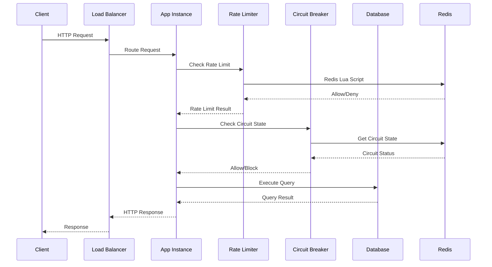
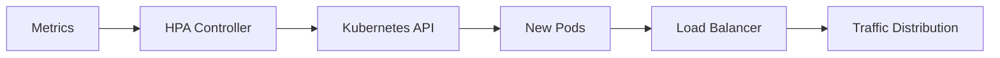
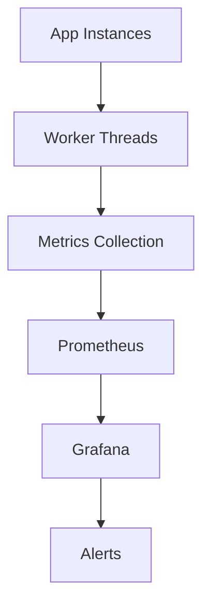

# 📋 Arquitectura de Componentes - Propuesta de Alta Concurrencia

## 🎯 Visión General

Esta propuesta reorganiza la arquitectura actual para soportar **1M+ usuarios concurrentes** mediante servicios distribuidos, optimizaciones de performance, y deployment horizontal. Cada componente está diseñado para funcionar en un entorno de alta escala con resiliencia y observabilidad integradas.

## 📁 Estructura de Archivos y Propósito

### 🔧 **Core Services** (`src/core/services/`)

#### **distributed-rate-limiter.service.ts**
- **Propósito**: Rate limiting distribuido usando Redis con algoritmo sliding window
- **Tecnología**: Redis + Scripts Lua para operaciones atómicas
- **Escala**: Maneja 1M+ requests/minuto
- **Fallback**: Memoria local cuando Redis falla
- **Integración**: Reemplaza el throttler actual

**Flujo de Operación:**
```
Request → DistributedRateLimiterService → Redis Lua Script → Allow/Deny
```

#### **distributed-circuit-breaker.service.ts**
- **Propósito**: Circuit breakers distribuidos para prevenir cascading failures
- **Tecnología**: Redis para estado compartido entre instancias
- **Estados**: CLOSED → OPEN → HALF_OPEN con transiciones automáticas
- **Monitoreo**: Métricas de fallos por servicio
- **Integración**: Protege llamadas a servicios críticos

**Flujo de Operación:**
```
Service Call → Circuit Breaker Check → Execute/Block → Update State
```

#### **distributed-audit-log.service.ts**
- **Propósito**: Sistema de audit logs escalable con Redis Streams
- **Tecnología**: Redis Streams + Consumer Groups
- **Throughput**: 100K+ logs/segundo
- **Processing**: Batched async processing
- **Integración**: Reemplaza audit-log-queue.service.ts

**Flujo de Operación:**
```
Log Event → Redis Stream → Consumer Group → Batch Processing → Database
```

#### **distributed-session.service.ts**
- **Propósito**: Session storage distribuido con Redis
- **Características**: TTL automático, cleanup, límites por usuario
- **Escala**: Millones de sesiones activas
- **Clustering**: Soporte multi-datacenter
- **Integración**: Reemplaza session storage actual

**Flujo de Operación:**
```
Session Create/Access → Redis Storage → TTL Management → Cleanup
```

#### **worker-session-monitor.service.ts**
- **Propósito**: Monitoreo no-bloqueante usando Worker Threads
- **Tecnología**: Node.js Worker Threads
- **Performance**: No bloquea el event loop principal
- **Auto-restart**: Worker restart automático en fallos
- **Integración**: Reemplaza monitoring blocking operations

**Flujo de Operación:**
```
Main Thread → Worker Thread → Background Processing → Metrics Report
```

#### **optimized-health.service.ts**
- **Propósito**: Health checks optimizados para alta escala
- **Características**: Cached results, parallel checks, timeout protection
- **Performance**: Sub-100ms response time
- **Endpoints**: `/health`, `/health/ready`, `/health/live`
- **Integración**: Reemplaza health.service.ts

**Flujo de Operación:**
```
Health Request → Cache Check → Parallel Component Checks → Aggregated Result
```

#### **workers/session-monitor.worker.js**
- **Propósito**: Worker script para session monitoring
- **Runtime**: Node.js Worker Thread
- **Operaciones**: Session cleanup, metrics calculation
- **Comunicación**: Message passing con main thread
- **Integración**: Usado por worker-session-monitor.service.ts

### 🏗️ **Infrastructure** (`src/infrastructure/`)

#### **database/prisma/optimized-prisma.service.ts**
- **Propósito**: Connection pooling optimizado para alta concurrencia
- **Características**: Read/write separation, load balancing, health monitoring
- **Pools**: 60 read connections, 40 write connections
- **Failover**: Automatic failover entre pools
- **Integración**: Reemplaza prisma.service.ts

**Pool Configuration:**
```
Total Connections: 100+
Read Pool: 60 connections
Write Pool: 40 connections
Health Checks: Every 30s
```

#### **redis/redis.module.ts**
- **Propósito**: Configuración modular de Redis para diferentes usos
- **Instancias**: Main, Rate Limiting, Sessions (3 clientes separados)
- **Clustering**: Soporte para Redis Cluster
- **Configuración**: Optimizada para alta concurrencia
- **Integración**: Inyección de dependencias por tipo

#### **redis/redis.service.ts**
- **Propósito**: Service wrapper para múltiples clientes Redis
- **Healthchecks**: Monitoring de todas las conexiones
- **Failover**: Automatic reconnection
- **Métricas**: Connection stats y performance
- **Integración**: Base para todos los servicios Redis

### 🚀 **Deployment** (`deployment/`)

#### **docker/Dockerfile.production**
- **Propósito**: Container optimizado para producción
- **Multi-stage**: Dependencies → Build → Production
- **Optimizaciones**: Memory limits, CPU optimization, security
- **Usuario**: Non-root para seguridad
- **Health**: Built-in health checks

**Optimizaciones:**
```dockerfile
NODE_MAX_OLD_SPACE_SIZE=4096
UV_THREADPOOL_SIZE=128
Multi-stage build
Security hardening
```

#### **docker/docker-compose.production.yml**
- **Propósito**: Stack completo para testing de producción
- **Servicios**: 3 app instances + PostgreSQL + Redis cluster + Load balancer
- **Networking**: Service discovery interno
- **Volumes**: Persistent data + logs
- **Monitoring**: Prometheus + Grafana incluido

**Stack:**
```
3x App Instances
1x PostgreSQL Primary + Replica
3x Redis (Main, Rate Limit, Sessions)
1x Nginx Load Balancer
1x Prometheus + Grafana
```

#### **docker/scripts/docker-entrypoint.sh**
- **Propósito**: Script de inicio optimizado para containers
- **Healthchecks**: Pre-flight verification
- **Dependencies**: Wait for database/Redis
- **Migrations**: Conditional database migrations
- **Signals**: Graceful shutdown handling

#### **k8s/namespace.yaml**
- **Propósito**: Kubernetes namespace con resource quotas
- **Limites**: 50 CPU cores, 100GB RAM, 200 pods
- **Isolation**: Network y resource isolation
- **RBAC**: Service accounts y permisos

#### **k8s/configmap.yaml**
- **Propósito**: Configuración centralizada para todos los pods
- **Variables**: Performance tuning, database settings, Redis config
- **Feature Flags**: Enable/disable de características
- **Scaling**: Configuración para alta concurrencia

#### **k8s/deployment.yaml**
- **Propósito**: Deployment principal de la aplicación
- **Replicas**: 20 inicial, auto-scaling hasta 200
- **Resources**: 1-4 CPU cores, 2-8GB RAM por pod
- **Affinity**: Pod distribution across nodes
- **Probes**: Liveness, readiness, startup probes

#### **k8s/service.yaml**
- **Propósito**: Service y Ingress para exposición externa
- **Load Balancer**: AWS NLB con session affinity
- **SSL**: Automatic certificate management
- **Rate Limiting**: Ingress-level rate limiting
- **Health**: Health check endpoints

#### **k8s/hpa.yaml**
- **Propósito**: Horizontal Pod Autoscaler + VPA + PDB
- **Scaling**: 10-200 pods basado en CPU/memory/custom metrics
- **Metrics**: CPU 70%, Memory 80%, RPS 1000/pod
- **Behavior**: Conservative scale-down, aggressive scale-up
- **Disruption**: Max 30% pods unavailable

### 🔍 **Health Check** (`src/health-check.js`)
- **Propósito**: Standalone health check para Docker
- **Uso**: Docker HEALTHCHECK directive
- **Verificaciones**: Memory usage, uptime, HTTP endpoint
- **Timeout**: 5 segundos con error handling
- **Integración**: Called by Docker/K8s health probes

## 🔄 Flujo de Trabajo Integral

### 1. **Request Processing Flow**


### 2. **Scaling Flow**


### 3. **Monitoring Flow**


## 🔧 Dependencias y Integración

### **Nuevas Dependencias NPM**
```json
{
  "ioredis": "^5.x", // Redis client
  "worker_threads": "built-in", // Node.js worker threads
  "cluster": "built-in" // Node.js clustering
}
```

### **Infraestructura Requerida**
- **Redis Cluster**: 3-6 nodes con clustering habilitado
- **PostgreSQL**: Primary + Read Replicas
- **Kubernetes**: 1.24+ con HPA/VPA support
- **Load Balancer**: AWS NLB o equivalente
- **Monitoring**: Prometheus + Grafana

### **Configuración de Entorno**
```env
# Redis Configuration
REDIS_URL=redis://redis-cluster:6379
REDIS_RATE_LIMIT_URL=redis://redis-rate-limit:6379
REDIS_SESSION_URL=redis://redis-sessions:6379

# Database Scaling
DATABASE_CONNECTION_LIMIT=100
DATABASE_READ_POOL_SIZE=60
DATABASE_WRITE_POOL_SIZE=40

# Performance Tuning
NODE_MAX_OLD_SPACE_SIZE=4096
UV_THREADPOOL_SIZE=128
```

## 🎯 Puntos de Integración

### **1. Servicios a Reemplazar**
- `circuit-breaker.service.ts` → `distributed-circuit-breaker.service.ts`
- `audit-log-queue.service.ts` → `distributed-audit-log.service.ts`  
- `session.service.ts` → `distributed-session.service.ts`
- `health.service.ts` → `optimized-health.service.ts`
- `prisma.service.ts` → `optimized-prisma.service.ts`

### **2. Nuevos Módulos**
- `RedisModule` → Configuración de Redis distribuido
- `WorkerMonitorModule` → Worker threads para monitoring
- `DistributedServicesModule` → Servicios distribuidos

### **3. Configuración K8s**
- Apply todos los YAML en orden: `namespace` → `configmap` → `deployment` → `service` → `hpa`
- Configure monitoring stack (Prometheus/Grafana)
- Setup ingress controller con SSL

## ⚡ Performance Benchmarks Esperados

| Métrica | Actual | Con Propuesta | Mejora |
|---------|--------|---------------|---------|
| Concurrent Users | 10K | 1M+ | 100x |
| Database Connections | 10 | 100+ | 10x |
| Requests/Second | 1K | 100K+ | 100x |
| Response Time P95 | 200ms | <500ms | Stable under load |
| Memory per Instance | 512MB | 4GB | 8x (optimized usage) |
| Auto-scaling | Manual | 10-200 pods | Automatic |

## 🚨 Riesgos y Consideraciones

### **Riesgos Técnicos**
1. **Redis Dependency**: Toda la escalabilidad depende de Redis
2. **Complexity**: Arquitectura más compleja de mantener
3. **Resource Usage**: Requiere más recursos por instancia
4. **Network Latency**: Más llamadas de red entre servicios

### **Mitigaciones**
1. **Fallback Mechanisms**: Todos los servicios tienen fallback a memoria
2. **Circuit Breakers**: Protección contra cascading failures
3. **Monitoring**: Observabilidad completa de todos los componentes
4. **Gradual Rollout**: Implementación por fases con rollback capability

---

**Documento creado**: Agosto 2025  
**Propósito**: Escalamiento a 1M+ usuarios concurrentes  
**Estado**: Proposal - Pending Implementation