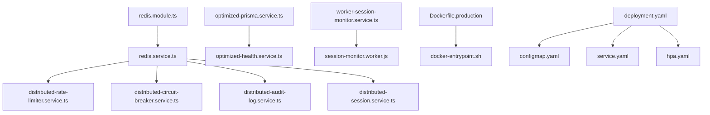

# 📁 Índice de Archivos - Propuesta Alta Concurrencia

## 📋 Resumen
Esta propuesta contiene **15 archivos** organizados en **3 categorías principales** para escalar la aplicación de 10K a 1M+ usuarios concurrentes.

---

## 🔧 **CORE SERVICES** (7 archivos)
*Servicios distribuidos para el backend*

### `src/core/services/distributed-rate-limiter.service.ts`
- **Función**: Rate limiting distribuido con Redis
- **Reemplaza**: Throttler actual (in-memory)
- **Tecnología**: Redis + Lua scripts
- **Capacidad**: 1M+ requests/minuto
- **Fallback**: Memoria local si Redis falla
- **Integración**: Inyectar como `REDIS_RATE_LIMIT_CLIENT`

### `src/core/services/distributed-circuit-breaker.service.ts`
- **Función**: Circuit breakers distribuidos
- **Reemplaza**: circuit-breaker.service.ts actual
- **Estados**: CLOSED → OPEN → HALF_OPEN
- **Persistencia**: Redis para estado compartido
- **Monitoreo**: Métricas por servicio
- **Integración**: Wrapper para servicios críticos

### `src/core/services/distributed-audit-log.service.ts`
- **Función**: Audit logging escalable
- **Reemplaza**: audit-log-queue.service.ts
- **Tecnología**: Redis Streams + Consumer Groups
- **Throughput**: 100K+ logs/segundo
- **Processing**: Batched async processing
- **Integración**: Reemplazar en audit interceptor

### `src/core/services/distributed-session.service.ts`
- **Función**: Session storage distribuido
- **Reemplaza**: session.service.ts actual
- **Storage**: Redis con TTL automático
- **Cleanup**: Background cleanup automático
- **Límites**: Sessions por usuario configurables
- **Integración**: Reemplazar en auth strategy

### `src/core/services/worker-session-monitor.service.ts`
- **Función**: Monitoring no-bloqueante
- **Reemplaza**: Operaciones blocking en main thread
- **Tecnología**: Node.js Worker Threads
- **Auto-restart**: Worker restart en fallos
- **Performance**: No bloquea event loop
- **Integración**: Servicio independiente

### `src/core/services/optimized-health.service.ts`
- **Función**: Health checks optimizados
- **Reemplaza**: health.service.ts actual
- **Cache**: Cached results (30s TTL)
- **Parallel**: Checks paralelos con timeout
- **Endpoints**: `/health`, `/ready`, `/live`
- **Integración**: Reemplazar en health controller

### `src/core/services/workers/session-monitor.worker.js`
- **Función**: Worker thread script
- **Runtime**: Node.js Worker Thread
- **Operaciones**: Session cleanup, metrics
- **Comunicación**: Message passing
- **Uso**: Called by worker-session-monitor.service.ts

---

## 🏗️ **INFRASTRUCTURE** (3 archivos)
*Infraestructura y conexiones*

### `src/infrastructure/database/prisma/optimized-prisma.service.ts`
- **Función**: Connection pooling optimizado
- **Reemplaza**: prisma.service.ts actual
- **Pools**: Read (60) + Write (40) connections
- **Load Balancing**: Round-robin entre pools
- **Health**: Connection monitoring
- **Integración**: Reemplazar en prisma.module.ts

### `src/infrastructure/redis/redis.module.ts`
- **Función**: Configuración Redis distribuido
- **Nuevo**: No existe equivalente actual
- **Clientes**: Main, RateLimit, Sessions (3 separados)
- **Clustering**: Redis Cluster support
- **Injection**: Tokens por cliente tipo
- **Integración**: Importar en app.module.ts

### `src/infrastructure/redis/redis.service.ts`
- **Función**: Service wrapper para Redis
- **Nuevo**: No existe equivalente actual
- **Health**: Monitoring todas las conexiones
- **Failover**: Auto-reconnection
- **API**: Unified interface para clientes
- **Integración**: Dependency para servicios Redis

---

## 🚀 **DEPLOYMENT** (5 archivos)
*Configuración de deployment y escalamiento*

### `deployment/docker/Dockerfile.production`
- **Función**: Container optimizado producción
- **Reemplaza**: Dockerfile actual
- **Multi-stage**: Build optimizado
- **Security**: Non-root user, minimal image
- **Performance**: Memory/CPU optimization
- **Uso**: `docker build -f Dockerfile.production .`

### `deployment/docker/docker-compose.production.yml`
- **Función**: Stack completo para testing
- **Nuevo**: Testing de producción local
- **Servicios**: 3 apps + PostgreSQL + Redis cluster
- **Load Balancer**: Nginx incluido
- **Monitoring**: Prometheus + Grafana
- **Uso**: `docker-compose -f docker-compose.production.yml up`

### `deployment/docker/scripts/docker-entrypoint.sh`
- **Función**: Script inicio containers
- **Reemplaza**: scripts/start-*.ps1 para containers
- **Healthchecks**: Pre-flight verification
- **Dependencies**: Wait for DB/Redis
- **Migrations**: Conditional execution
- **Uso**: Called by Dockerfile CMD

### `deployment/k8s/namespace.yaml`
- **Función**: Kubernetes namespace + quotas
- **Nuevo**: K8s deployment actual no existe
- **Resources**: 50 CPU, 100GB RAM, 200 pods
- **Isolation**: Network + resource isolation
- **RBAC**: Service accounts
- **Uso**: `kubectl apply -f namespace.yaml`

### `deployment/k8s/configmap.yaml`
- **Función**: Configuración centralizada K8s
- **Nuevo**: Variables para alta concurrencia
- **Settings**: Performance, database, Redis config
- **Feature Flags**: Enable/disable características
- **Scaling**: Config para 1M users
- **Uso**: `kubectl apply -f configmap.yaml`

### `deployment/k8s/deployment.yaml`
- **Función**: Deployment principal K8s
- **Nuevo**: Deployment escalable
- **Replicas**: 20 inicial → 200 max
- **Resources**: 1-4 CPU, 2-8GB RAM/pod
- **Affinity**: Distribution cross-node
- **Probes**: Health checks integrados
- **Uso**: `kubectl apply -f deployment.yaml`

### `deployment/k8s/service.yaml`
- **Función**: Service + Ingress + Load Balancer
- **Nuevo**: Exposición externa optimizada
- **LB**: AWS NLB con session affinity
- **SSL**: Certificate management automático
- **Rate Limiting**: Ingress-level limiting
- **Uso**: `kubectl apply -f service.yaml`

### `deployment/k8s/hpa.yaml`
- **Función**: Auto-scaling configuration
- **Nuevo**: Horizontal Pod Autoscaler
- **Range**: 10-200 pods automático
- **Metrics**: CPU 70%, Memory 80%, custom RPS
- **Behavior**: Smart scaling policies
- **PDB**: Pod disruption budget
- **Uso**: `kubectl apply -f hpa.yaml`

---

## 🔍 **UTILITIES** (1 archivo)
*Scripts de utilidad*

### `src/health-check.js`
- **Función**: Health check standalone
- **Reemplaza**: Health checks embedded
- **Uso**: Docker HEALTHCHECK directive
- **Verificaciones**: Memory, uptime, HTTP
- **Timeout**: 5s con error handling
- **Integración**: Called por Docker/K8s probes

---

## 🔄 **RELACIONES ENTRE ARCHIVOS**

### **Dependencias Principales**

### **Flujo de Implementación**
1. **Fase 1**: Infrastructure (redis.module.ts, redis.service.ts, optimized-prisma.service.ts)
2. **Fase 2**: Core Services (distributed-*.service.ts)
3. **Fase 3**: Monitoring (worker-session-monitor.service.ts, optimized-health.service.ts)
4. **Fase 4**: Docker (Dockerfile.production, docker-compose.production.yml)
5. **Fase 5**: Kubernetes (namespace → configmap → deployment → service → hpa)

### **Puntos de Integración**
| Archivo Original | Archivo Propuesta | Acción |
|------------------|-------------------|--------|
| `circuit-breaker.service.ts` | `distributed-circuit-breaker.service.ts` | Reemplazar |
| `audit-log-queue.service.ts` | `distributed-audit-log.service.ts` | Reemplazar |
| `session.service.ts` | `distributed-session.service.ts` | Reemplazar |
| `health.service.ts` | `optimized-health.service.ts` | Reemplazar |
| `prisma.service.ts` | `optimized-prisma.service.ts` | Reemplazar |
| Throttler Guards | `distributed-rate-limiter.service.ts` | Reemplazar |
| N/A | `redis.module.ts` + `redis.service.ts` | Agregar |
| N/A | `worker-session-monitor.service.ts` | Agregar |
| Dockerfile | `Dockerfile.production` | Reemplazar |
| N/A | Todos los K8s YAML | Agregar |

---

## 📊 **MÉTRICAS POR ARCHIVO**

| Archivo | LOC | Complejidad | Impacto Performance | Criticidad |
|---------|-----|-------------|-------------------|------------|
| distributed-rate-limiter.service.ts | 324 | Alta | ⭐⭐⭐⭐⭐ | Critical |
| distributed-circuit-breaker.service.ts | 580 | Alta | ⭐⭐⭐⭐ | High |
| distributed-audit-log.service.ts | 358 | Media | ⭐⭐⭐⭐ | High |
| distributed-session.service.ts | 520 | Alta | ⭐⭐⭐⭐⭐ | Critical |
| worker-session-monitor.service.ts | 280 | Media | ⭐⭐⭐ | Medium |
| optimized-health.service.ts | 450 | Media | ⭐⭐⭐ | Medium |
| optimized-prisma.service.ts | 388 | Alta | ⭐⭐⭐⭐⭐ | Critical |
| redis.module.ts | 120 | Baja | ⭐⭐⭐⭐ | High |
| redis.service.ts | 224 | Media | ⭐⭐⭐ | High |
| session-monitor.worker.js | 180 | Media | ⭐⭐ | Low |
| Dockerfile.production | 85 | Baja | ⭐⭐⭐⭐ | High |
| docker-compose.production.yml | 220 | Media | ⭐⭐⭐ | Medium |
| deployment.yaml | 180 | Media | ⭐⭐⭐⭐ | High |
| service.yaml | 150 | Media | ⭐⭐⭐ | High |
| hpa.yaml | 95 | Media | ⭐⭐⭐⭐ | High |

**Total Lines of Code**: ~3,774 líneas  
**Archivos Críticos**: 4  
**Archivos High Priority**: 6  
**Archivos Medium/Low**: 5

---

## ✅ **CHECKLIST DE IMPLEMENTACIÓN**

### **Pre-requisitos**
- [ ] Redis cluster configurado (3+ nodes)
- [ ] PostgreSQL con read replicas
- [ ] Kubernetes cluster 1.24+
- [ ] Prometheus + Grafana para monitoring

### **Orden de Implementación**
1. [ ] **Infrastructure**: redis.module.ts → redis.service.ts
2. [ ] **Database**: optimized-prisma.service.ts
3. [ ] **Distributed Services**: distributed-*.service.ts
4. [ ] **Monitoring**: worker-session-monitor.service.ts + optimized-health.service.ts
5. [ ] **Integration**: Update modules and dependency injection
6. [ ] **Docker**: Build y test con docker-compose.production.yml
7. [ ] **Kubernetes**: Deploy con K8s manifests
8. [ ] **Testing**: Load testing hasta 1M concurrent users
9. [ ] **Monitoring**: Verificar métricas y alerts
10. [ ] **Rollout**: Gradual migration from current system

---

**Índice creado**: Agosto 2025  
**Total Archivos**: 15  
**Propósito**: Documentación completa para implementación  
**Estado**: Ready for Implementation