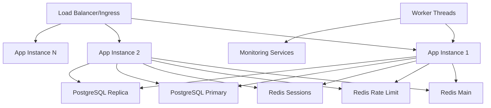

# 🚀 Propuesta: Escalamiento para Alta Concurrencia (1M+ Usuarios)

## 📋 Resumen Ejecutivo

Esta propuesta presenta una arquitectura completamente rediseñada para escalar la aplicación NestJS de **10K usuarios concurrentes** a **1M+ usuarios concurrentes**. La implementación incluye servicios distribuidos, optimizaciones de base de datos, caché distribuido, monitoreo con worker threads, circuit breakers, y configuración para deployment horizontal con Docker y Kubernetes.

## 🎯 Objetivos

- **Escalabilidad**: Soportar 1,000,000+ usuarios concurrentes
- **Performance**: Mantener latencia P95 < 500ms bajo carga máxima  
- **Disponibilidad**: 99.95% uptime con auto-recovery
- **Resiliencia**: Circuit breakers y graceful degradation
- **Observabilidad**: Monitoreo completo y métricas en tiempo real

## 📊 Capacidades Actuales vs. Propuestas

| Métrica | Actual | Propuesta | Mejora |
|---------|--------|-----------|---------|
| Usuarios Concurrentes | ~10K | 1M+ | 100x |
| Conexiones DB | 10 | 100+ pooled | 10x |
| RPS (Requests/sec) | ~1K | 100K+ | 100x |
| Latencia P95 | ~200ms | <500ms | Mantiene bajo carga |
| Instancias | 1 | 10-200 auto-scale | Auto-scaling |
| Caché | In-memory | Redis distribuido | Distribuido |

## 🏗️ Arquitectura de la Solución

### Componentes Principales



### Flujo de Trabajo de Alta Concurrencia

1. **Request Ingress**: Load balancer distribuye tráfico entre instancias
2. **Rate Limiting**: Redis-based sliding window algorithm
3. **Session Management**: Distributed session storage en Redis
4. **Database Operations**: Connection pooling con read/write separation
5. **Circuit Breakers**: Auto-protection contra cascading failures
6. **Monitoring**: Worker threads para operaciones no-bloqueantes
7. **Auto-scaling**: HPA escala instancias según métricas

## 📁 Estructura de Archivos de la Propuesta

### Core Services (Servicios Distribuidos)

```
src/core/services/
├── high-concurrency-distributed-rate-limiter.service.ts
├── high-concurrency-distributed-circuit-breaker.service.ts
├── high-concurrency-distributed-audit-log.service.ts
├── high-concurrency-distributed-session.service.ts
├── high-concurrency-worker-session-monitor.service.ts
├── high-concurrency-optimized-health.service.ts
└── workers/
    └── high-concurrency-session-monitor.worker.js
```

### Infrastructure (Infraestructura)

```
src/infrastructure/
├── database/prisma/
│   └── high-concurrency-optimized-prisma.service.ts
└── redis/
    ├── high-concurrency-redis.module.ts
    └── high-concurrency-redis.service.ts
```

### Deployment (Configuración de Deploy)

```
deployment/
├── docker/
│   ├── high-concurrency-Dockerfile.production
│   ├── high-concurrency-docker-compose.production.yml
│   └── scripts/
│       └── high-concurrency-docker-entrypoint.sh
├── k8s/
│   ├── high-concurrency-namespace.yaml
│   ├── high-concurrency-configmap.yaml
│   ├── high-concurrency-deployment.yaml
│   ├── high-concurrency-service.yaml
│   └── high-concurrency-hpa.yaml
└── health-check/
    └── high-concurrency-health-check.js
```

## 🔄 Relaciones Entre Componentes

### 1. **Rate Limiting Flow**
```
Request → DistributedRateLimiterService → Redis (Lua Script) → Allow/Deny
```

### 2. **Session Management Flow**  
```
Auth Request → DistributedSessionService → Redis Sessions → Session Data
```

### 3. **Database Operations Flow**
```
Query → OptimizedPrismaService → Connection Pool → Read/Write Separation → PostgreSQL
```

### 4. **Circuit Breaker Flow**
```
Service Call → DistributedCircuitBreakerService → Redis State → Open/Closed/Half-Open
```

### 5. **Monitoring Flow**
```
Metrics → WorkerSessionMonitorService → Worker Thread → Non-blocking Processing
```

### 6. **Health Check Flow**
```
K8s Probe → OptimizedHealthService → Cached Results → Component Status
```

## 🚀 Implementación por Fases

### Fase 1: Servicios Base (Semana 1-2)
- [ ] Implementar Redis distribuido
- [ ] Migrar rate limiting a Redis
- [ ] Optimizar connection pooling

### Fase 2: Resilencia (Semana 3)  
- [ ] Circuit breakers distribuidos
- [ ] Worker threads para monitoreo
- [ ] Health checks optimizados

### Fase 3: Sesiones Distribuidas (Semana 4)
- [ ] Session storage en Redis
- [ ] Audit logs con streaming
- [ ] Cleanup automático

### Fase 4: Deployment (Semana 5)
- [ ] Docker optimizado
- [ ] Kubernetes configuration
- [ ] Auto-scaling setup

## 📈 Métricas de Éxito

### Performance KPIs
- **Throughput**: >100,000 RPS
- **Latency P95**: <500ms  
- **Concurrency**: 1M+ simultaneous users
- **Error Rate**: <0.1%

### Availability KPIs  
- **Uptime**: 99.95%
- **MTTR**: <5 minutes
- **Auto-recovery**: 100% failures handled

### Resource KPIs
- **CPU Utilization**: <70% average  
- **Memory Utilization**: <80% average
- **Database Connections**: <80% of pool

## 🔧 Configuración Requerida

### Environment Variables
```env
# Database Scaling
DATABASE_CONNECTION_LIMIT=100
DATABASE_READ_POOL_SIZE=60
DATABASE_WRITE_POOL_SIZE=40

# Redis Configuration  
REDIS_URL=redis://redis-main:6379
REDIS_RATE_LIMIT_URL=redis://redis-rate-limit:6379
REDIS_SESSION_URL=redis://redis-sessions:6379

# Performance Tuning
NODE_MAX_OLD_SPACE_SIZE=4096
UV_THREADPOOL_SIZE=128
```

### Resource Requirements

**Per Instance:**
- CPU: 2-4 cores
- RAM: 4-8GB  
- Storage: 20GB SSD

**Infrastructure:**
- PostgreSQL: 16 cores, 64GB RAM
- Redis Cluster: 8 cores, 32GB RAM
- Kubernetes: 50+ cores, 100GB RAM

## 🛡️ Seguridad y Monitoreo

### Security Features
- Rate limiting por IP/usuario
- Session security distribuida
- Circuit breakers contra DoS
- Resource isolation

### Monitoring Stack
- Prometheus para métricas
- Grafana para dashboards  
- Health checks nativos
- Worker thread monitoring

## 🎯 Beneficios Esperados

### Técnicos
- **100x** mejora en concurrencia
- **Latencia estable** bajo carga extrema
- **Auto-recovery** ante fallos
- **Horizontal scaling** automático

### Negocio  
- Soporte para crecimiento exponencial
- Reducción de costos operativos
- Mejor experiencia de usuario
- Disponibilidad enterprise-grade

## 🚨 Riesgos y Mitigaciones

| Riesgo | Probabilidad | Impacto | Mitigación |
|--------|--------------|---------|------------|
| Redis cluster failure | Media | Alto | Fallback a memoria + monitoring |
| Database bottleneck | Baja | Alto | Read replicas + connection pooling |
| Memory leaks | Media | Medio | Worker threads + garbage collection |
| Network partitions | Baja | Alto | Circuit breakers + graceful degradation |

## 📝 Siguientes Pasos

1. **Review técnico** de la propuesta
2. **Approval** para implementación  
3. **Resource allocation** (infraestructura)
4. **Implementation timeline** detallado
5. **Testing strategy** definida
6. **Rollout plan** progresivo

---

**Propuesta creada por**: Claude Code Assistant  
**Fecha**: Agosto 2025  
**Versión**: 1.0  
**Estado**: Pending Review